# Predicting House Prices: Hyperdrive VS Azure ML
## Overview
This is a capstone project completed as part of the inauguaral class for Udacity's Azure ML Nanodegree.
This project makes use of [Ames Housing Dataset](http://jse.amstat.org/v19n3/decock/AmesHousing.txt)<sup>1</sup> made available for education from Dean De Cock  and featured/introduced to me through Kaggle's [Getting Started Prediction Competition](https://www.kaggle.com/c/house-prices-advanced-regression-techniques).  

A rough diagram of our process is below:
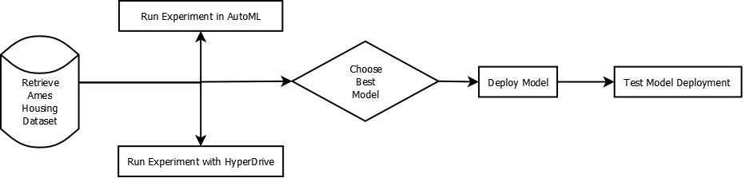

## Project Set Up and Installation
### Python Packages
[azureml-core 1.26.0](https://docs.microsoft.com/en-us/python/api/overview/azure/ml/install?view=azure-ml-py) - Azure Machine Learning SDK for Python
[json 2.0.9](https://docs.python.org/3/library/json.html#module-json) - 
[requests 2.25.1](https://pypi.org/project/requests/) 
[joblib 0.14.1]() - for saving the best model
[kaggle](https://pypi.org/project/kaggle/) (optional) - for getting data using the Kaggle API


### Software Requirements
[Python 3.8.1](https://www.python.org/downloads/release/python-381/) - for running entry_script (`score.py`)
[Azure Machine Learning](https://azure.microsoft.com/en-us/services/machine-learning/) - for AutoML 
[VM Instance for Running Jupyter Notebooks](https://azure.microsoft.com/en-us/services/virtual-machines/data-science-virtual-machines/)  


### Task

The data contains 81 predictors for 2,930 properties in Ames, IA; the task at hand is predict the cost of a house based on features of the given property.

The goal is to compare two models: one model is built using Microsoft's AutoML and another one is a custom built model using HyperDrive. 

For each we select the best model based on performance metrics and deploy it for consumption. 

We are trying to determine which model is better at estimating the sale price for a given house in Ames, Iowa.

For AutoML I made use of featurization to determine which features to use with few exceptions.
I knew going in that `Order` and `PID` were not going to be useful features, as they specify the parcel I.D. number (for reviewing on the city website) and the observation number, so are effectively meaningless.

For AutoML I set the featurization to 'auto' and let it ensure all features would be optimized/used.


### Access
#### Access - Original Data
To access the full dataset, I simply clicked **Datasets** and then from the _create dataset_ dropdown selected "Create dataset from web files."

This opens a menu which allows you to put in the following Web URL: 
  * http://jse.amstat.org/v19n3/decock/AmesHousing.txt

The data contains 81 predictors for 2,930 properties in Ames, IA.

#### Access - Kaggle Version, pre-split (not used for this project)
>Originally I was going to use Kaggle's version - in the process, I discovered how to access Kaggle from Azure ML. There were so notable shortcoming to this data - this version of the data has less observations with sales price since it breaks it out into training and testing datasets; it also manipulates the original columns slightly.  For the sake of transparency, I wanted to work with as close to the true source of that data as possible. 
I have left the following here for those interested in how to access Kaggle data from Azure ML.

To access this version of the dataset, you need a Kaggle account and to request an an API key.

You also need to install the package `kaggle` for Python:
`pip install kaggle`

If you're using a VM on the workspace, you type the same command.

Retrieve your key and username from Kaggle under **Account.**
Once you have these, from the workspace, you can export these keys to your environment variables:
`export KAGGLE_USERNAME=<YOUR_USERNAME>`
`export KAGGLE_KEY</YOUR_KEY>`

Finally, in the same command prompt window, type:
`kaggle competitions download -c house-prices-advanced-regression-techniques`

This downloads a zip file named **house_prices-advanced-regression-techniques.zip** to your Downloads folder.

When you unzip, you will see it contains:
* **train.csv**
* **test.csv**
* **data_description.txt**

Once download, I clicked *Datasets* under the Assets section of my workspace. Select *Create dataset from local files* and uploaded **train.csv** - it is a delimited, comma-separated file and we'll use headers from the first file, skipping no rows.

There are 81 columns and 1460 rows in the training dataset.


### After upload
Once uploaded it's split into training/test and then imported the following way:
```
key = 'AmesHousingData'
if key in ws.datasets.keys():
    data = ws.datasets[key]
    print(f"Dataset {key} located and loaded in.")
else:
    print(f"Cannot find {key}.")

# Load to pandas df
df = data.to_pandas_dataframe()
```

## Automated ML
### Settings
The `automl` settings were set up basically for one of two reasons:
1. Limiting the run-time/cost on the machine:
* **compute_target**  Use a **Standard_DS12_v2** virtual machine with 4 cores, 28GB RAM, and 56 GB storage with a minimum of one node; even though the datset is small, I wanted the fastest feedback loops available to me.
* **iterations** - 20
* **enable_early_stopping** - True
* **experiment_timeout_minutes** - 20
2. Using best practices for the problem at hand:  
* **primary_metric** - normalized root mean squared error
* **n_cross_validations** - 5 
* **featurization** - auto
By using standard 5 cross validations we are ensuring the models stability when looking aat new data. Due to the large number of features, Microsoft's featurization is set to auto to help with determining which features to ultimately use.  

We are using the normalized RMSE (root mean squared error)  because the scale of the value-to-predict in this business use-case doesn't cover many orders of magnitude, the way that other regression scenarios might call for (in which case we'd use primary metrics like `r2_score` and `spearman_correlation`).

The root mean squared error is the square root of the expected squared difference between our target and predictions; it is then normalized by dividing by the range of the data.

The normalized RMSE is pretty inuitive and has the added benefit of not allowing for large errors. We will be looking for [a lower value since the RMSE is a negatively-oriented score.](https://docs.microsoft.com/en-us/azure/machine-learning/how-to-understand-automated-ml)


### Results
The lowest normalized RMSE we scored was .0.325 using a VoterEnsemble model, which was a combination of four models: 'LightGBM', 'XGBoostRegressor', 'SGD', 'ElasticNet' which each were given a different weight.

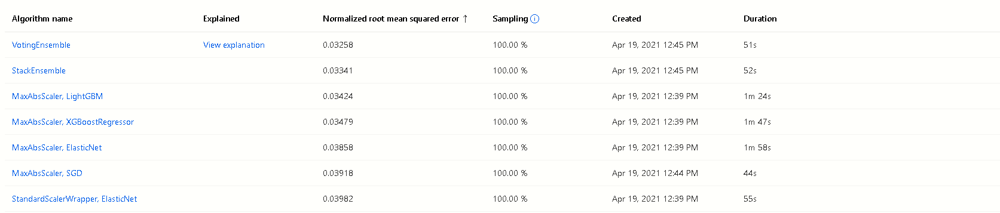
Output showing that the run completed:
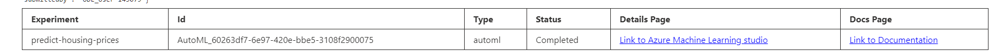
The output from the `RunDetails` widget shows us the score for NRMSE at each iteration (note that iteration 0 is not the winning model but the initial model):
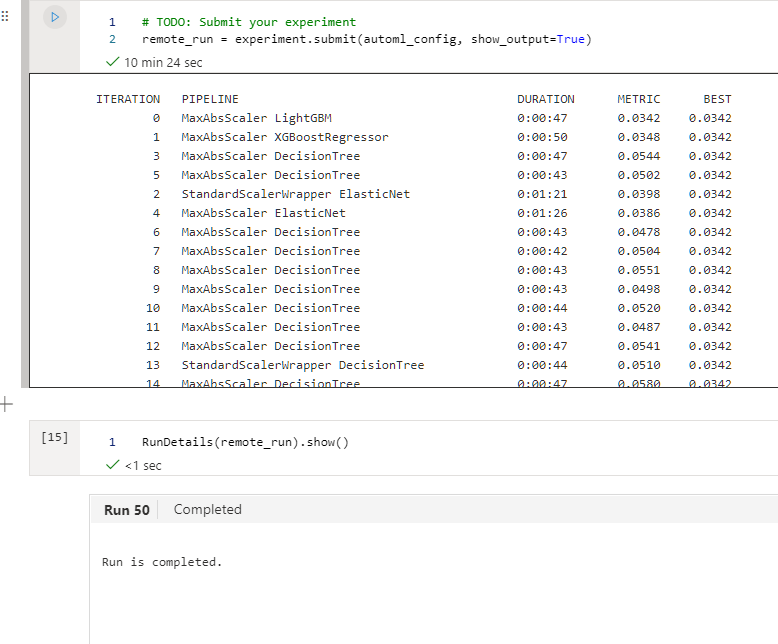

The properties show the winning model here:
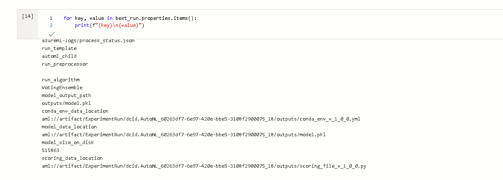

Here's an overview of the best run and the parameters AutoML used:
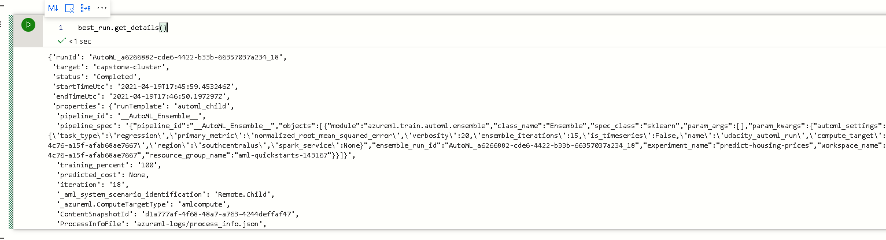

A picture of the best trained model with runId below:
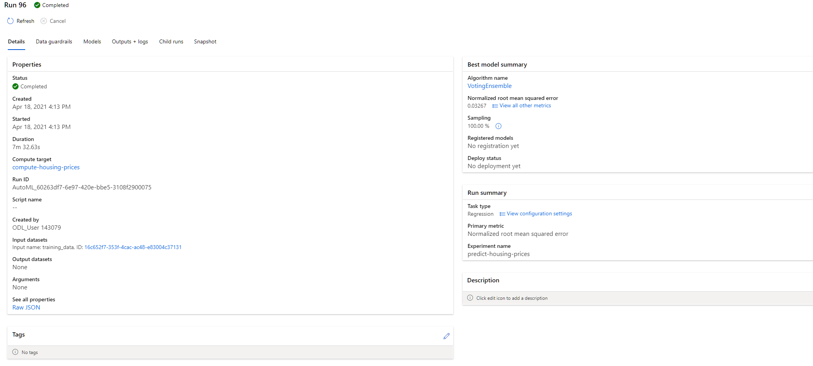


#### Possible Improvements

I'd like to look at some manual featurization based on my own intuition and see if AutoML performs better with columns where the missing data, conversion of columns to numeric, etc. are handled in part by me.

Removing columns which are highly correlated or combining some may be useful.

Looking at cardinality for keeping columns is another option.

In addition, removing outliers from our dataset where houses sold at prices, such as homes with high Sale Prices and low living area, should be analyzed and dealt with.


## Hyperparameter Tuning
<!-->TODO What kind of model did you choose for this experiment and why? Give an overview of the types of parameters and their ranges used for the hyperparameter search<-->
### Model Used
I am choosing to use a Gradient Boosted Regression Tree model by way of the `GradientBoostingRegressor` package. I'm using it because of its flexibility for non-parametric statistical learning for regression problems like this one.

I employed `RandomParameterSampling` with a `learning_rate` to shrink the contribution of each tree by a relatively small amount as well as a choice of boosting stages to perform since gradient boosting is fairly robust to over-fitting. still kept it reasonable low by intervals of 50 so that training was practical:
```
param_sampling = RandomParameterSampling(
    {
        "--learning_rate": uniform(0.01, 0.03),
        "--n_estimators": choice(100, 150, 200, 250) 
    }
)
```

For the policy I opted for BanditPolicy due to familiarity from the last project and usefulness for this project:
```
early_termination_policy = BanditPolicy(slack_factor=0.01, delay_evaluation=30)
```


`learning_rate` - I used a uniform `learning_rate` between _0.01-0.03_;
`n_estimators` - the values I used are _100, 150, 200, 250_. I kept this low and thought I'd expand it if higher seemed better; this did not turn out to be the case.
`max_depth` - I used a max depth of _1_ for the quickest feedback loop for a baseline model; I'd like to eventually increase this to 4-6.

    model = GradientBoostingRegressor(n_estimators=args.n_estimators, learning_rate=args.learning_rate, max_depth=1, random_state=0, loss='huber').fit(X_train, y_train)


### Results
<!-->TODO What are the results you got with your model? What were the parameters of the model? How could you have improved it?<-->
Our AutoML model completed:
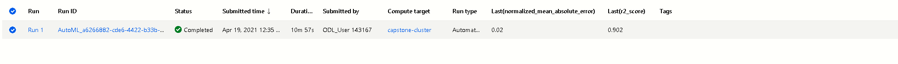

The lowest normalized RMSE was _0.54_, which was not as good as the AutoML model which was ~ 0.3.

The results from the `RunDetails` widget are shown here:
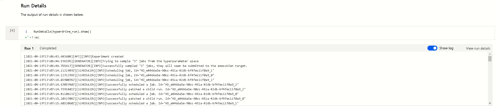

Here is a screenshot of the best model trained and its parameters:
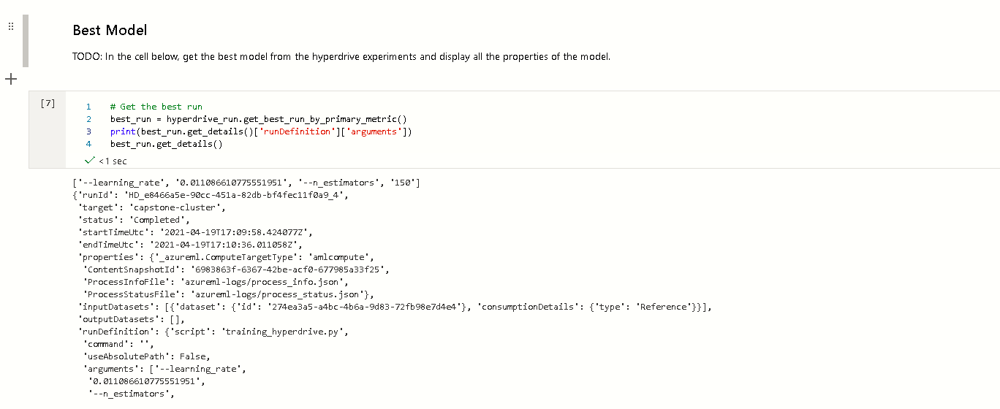

The parameters for the winning model were 150 `n_estimators` and a learning_rate of `0.0110866`.


See the following for the scores for our runs, with the top being the first listed:
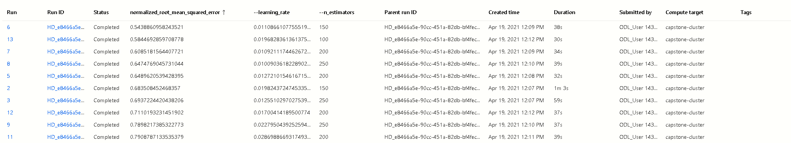


A snapshot of the completed experiment here:
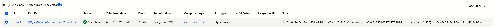


#### Improvements
I did the simplest version of cleaning/imputation in this model, with the ultimate goal of really seeing how well AutoML performs with little help.

For categorical data, I'd like to use one-hot  encoding.

To ensure that an automatically encoded categorical doesn't impact a model, I'd actually use one-hot encoding. The reason for this is so that the algorithm doesn't accidentally prioritize arbitrarily assigned numbers for the feature.<sup>3</sup>

In the future I'd like to use this as a baseline and compare models which involve much more feature engineering/conscious choices about dealing with null or categorical data.

There's plenty that can be done in this area with more time.

Feature scaling numerical attributes that have different scales using min-max scaling (standardization/normalization) would be useful in this area. The Scikit-Learn `StandardScaler` is available for similar standardization.

This technique allows for an ensemble of weak prediction models like decision trees which taken together over time produce strong learners to come up with a viable prediction.

The deeper the tree is allowed to get, the more variance could be captured. This allows for future work where I could explicitly grow the tree/add more trees (while keeping a lookout for overfitting), and comparing the results to this baseline model as well as seeing how well it does against the AutoML model.


##### Handling Categorical Columns
Ultimately I chose to eliminate the few columns which were categorical.

In a follow-up project, I'd like to use either a `LabelEncoder` or `OneHotEncode` to create features that can be used for the model. 

##### Replacing empty values with median/mean mode
For numerical values that are empty, I'd replace them with the most applicable statistic for the feature. 


## Model Deployment

Since `AutoML` has the best model, I deployed using the **automl.ipynb** notebook.

First we save the best model:
```
model_name = best_run.properties['model_name']
joblib.dump(model, 'best_fit_automl_model.pkl')
```

### Register Model
We register the model using the following:
```
model = Model.register(workspace=ws, model_name='best_fit_model', model_path='best_fit_automl_model.pkl')
```
### Create Inference config
To create an inference config:
```
inference_config = InferenceConfig(entry_script='score.py', environment=env)
```

### Deploy Model as web service
```
deployment_config = AciWebservice.deploy_configuration(cpu_cores=1, memory_gb=4, enable_app_insights=True)
service = Model.deploy(
    workspace=ws,
    name="predicting-house-prices",
    models=[model],
    inference_config=inference_config,
    deployment_config=deployment_config)
```
If it succeeds as planned, you should see the following:
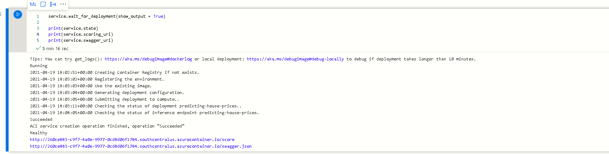
## Model Testing
To test the model, we make use of the test data.

I'm using a trick since I have so many columns; I shuffle the test data and randomly select a row. Once I've done that, I convert it to the format becessary to get a response.

```
shuffle(test).head(1).drop('SalePrice', axis=1).to_dict('records')
```

If you'd just like to enter them manually as an argument, here's one example:
```
[{'Order': 2252,
  'PID': 914460110,
  'MS SubClass': 20,
  'MS Zoning': 'RL',
  'Lot Frontage': 44.0,
  'Lot Area': 12864,
  'Street': 'Pave',
  'Alley': 'NA',
  'Lot Shape': 'IR1',
  'Land Contour': 'Lvl',
  'Utilities': 'AllPub',
  'Lot Config': 'CulDSac',
  'Land Slope': 'Gtl',
  'Neighborhood': 'Mitchel',
  'Condition 1': 'Norm',
  'Condition 2': 'Norm',
  'Bldg Type': '1Fam',
  'House Style': '1Story',
  'Overall Qual': 7,
  'Overall Cond': 5,
  'Year Built': 2002,
  'Year Remod/Add': 2002,
  'Roof Style': 'Gable',
  'Roof Matl': 'CompShg',
  'Exterior 1st': 'VinylSd',
  'Exterior 2nd': 'VinylSd',
  'Mas Vnr Type': 'None',
  'Mas Vnr Area': 0.0,
  'Exter Qual': 'Gd',
  'Exter Cond': 'TA',
  'Foundation': 'PConc',
  'Bsmt Qual': 'Gd',
  'Bsmt Cond': 'TA',
  'Bsmt Exposure': 'No',
  'BsmtFin Type 1': 'GLQ',
  'BsmtFin SF 1': 1392.0,
  'BsmtFin Type 2': 'Unf',
  'BsmtFin SF 2': 0.0,
  'Bsmt Unf SF': 17.0,
  'Total Bsmt SF': 1409.0,
  'Heating': 'GasA',
  'Heating QC': 'Ex',
  'Central Air': True,
  'Electrical': 'SBrkr',
  '1st Flr SF': 1409,
  '2nd Flr SF': 0,
  'Low Qual Fin SF': 0,
  'Gr Liv Area': 1409,
  'Bsmt Full Bath': 1.0,
  'Bsmt Half Bath': 0.0,
  'Full Bath': 1,
  'Half Bath': 1,
  'Bedroom AbvGr': 1,
  'Kitchen AbvGr': 1,
  'Kitchen Qual': 'Gd',
  'TotRms AbvGrd': 4,
  'Functional': 'Typ',
  'Fireplaces': 1,
  'Fireplace Qu': 'Gd',
  'Garage Type': 'Attchd',
  'Garage Yr Blt': 2002.0,
  'Garage Finish': 'RFn',
  'Garage Cars': 2.0,
  'Garage Area': 576.0,
  'Garage Qual': 'TA',
  'Garage Cond': 'TA',
  'Paved Drive': 'Y',
  'Wood Deck SF': 0,
  'Open Porch SF': 144,
  'Enclosed Porch': 0,
  '3Ssn Porch': 0,
  'Screen Porch': 145,
  'Pool Area': 0,
  'Pool QC': 'NA',
  'Fence': 'NA',
  'Misc Feature': 'NA',
  'Misc Val': 0,
  'Mo Sold': 7,
  'Yr Sold': 2007,
  'Sale Type': 'WD ',
  'Sale Condition': 'Normal'}]
```

To ensure we able to get predictions we do the following:
```
# URL for the web service
scoring_uri = 'http://68842658-d41c-49af-91c2-968a31355b17.southcentralus.azurecontainer.io/score' # <-- change this to output from above

# Set the content type
headers = {'Content-Type': 'application/json'}


# 
data = {"data":
        shuffle(test).head(1).drop('SalePrice', axis=1).to_dict('records')
        }
# Convert to JSON string
input_data = json.dumps(data)

# Make the request and display the response
resp = requests.post(scoring_uri, input_data, headers=headers)

print("Response Code : ", resp.status_code)
print("Predicted Value : ",resp.text)
```
The following should be output (with the prediction varying based on the input data):

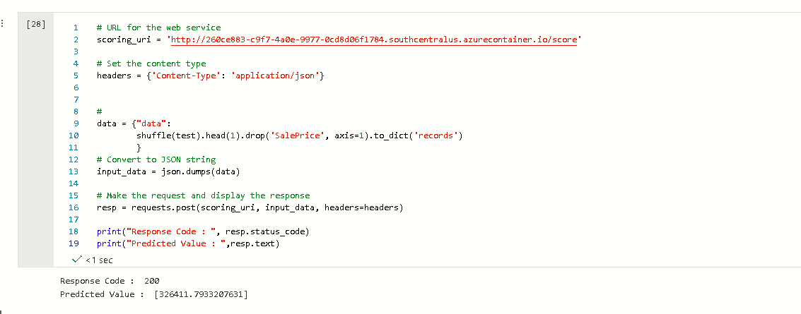

You can see that we have a healthy (active) endpoint in the Endpoints dashboard:
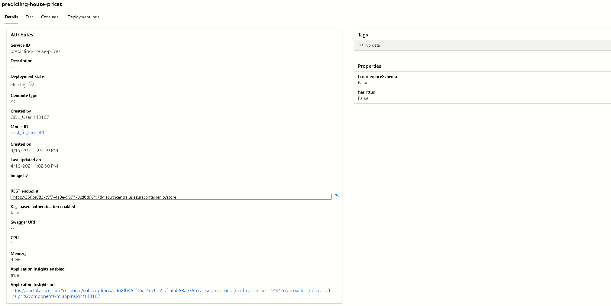

To see the logs, we type:
```print(service.logs())```

One this is completed, we need to delete the service:
```service.delete()```


## Screen Recording
[Screen recording demonstrating working model, demo of deployed model, and sample request sent to endpoint and response here.](https://youtu.be/vu5KaZe-IjM)

## References
<sup>1.</sup> [Documentation for Original Ames Housing Dataset](http://jse.amstat.org/v19n3/decock/DataDocumentation.txt)

<sup>2.</sup> [Kaggle Competition that uses an altered version of the original dataset](https://www.kaggle.com/c/house-prices-advanced-regression-techniques)

<sup>3.</sup> [Article covering similar project which talks about these issues.](https://medium.com/@RutvikBI/real-estate-price-estimation-using-the-gradient-boosting-regressor-e91440289378)
